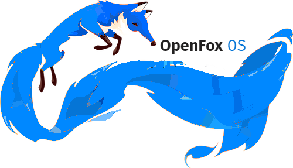

<h1>What's added ?</h1>

Inverter Market
New Wallpapers
More Launguages

<h1>How to add it ?</h1>

Press WebIDE button or press "shift+F8"
Inport FireFox OS 2.6 simulator addon
Decompress OpenFox OS 1.9 to new Folder
On Firefox OS 2.6 start button press "⚙"
In "Custom Gaia profile" placeholder add OpenFox OS to path
Start FireFox OS 2.6 Runtime 

<h1>Developers</h1>

Inverter Work Group:

<h6>Danil Vyushenko</h6>

Vectras Team:

<h6>Ahmed Barakat </h6>

<h1>Contacts:</h1>

Telegram Channels:

Inverter Work Group: t.me/InfinityOS
Vectras VM: t.me/vectras_os
